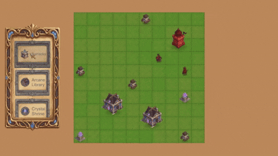
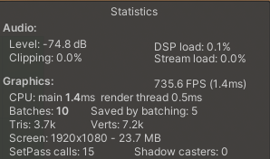

# Strategy Game Demo

A small 2D real-time-strategy demo built in **Unity 2021.3 LTS (URP, 2D Renderer)**: place buildings on a grid, produce soldiers from a barracks, and command them around with **custom A\* pathfinding** and click-to-attack combat. It was built to a fixed brief that's judged on architecture, code quality and correct use of a set of required concepts rather than on art or scope, so the design is kept as small as the brief allows.

<!-- Media lives in Docs/ so GitHub renders it directly in the README. -->


## Contents
- [How to run](#how-to-run)
- [Controls](#controls)
- [Requirement traceability](#requirement-traceability)
- [Required concepts and where they live](#required-concepts-and-where-they-live)
- [Architecture](#architecture)
- [A* pathfinding](#a-pathfinding)
- [Object pooling](#object-pooling)
- [Data-driven design and stats](#data-driven-design-and-stats)
- [Performance: draw calls](#performance-draw-calls)
- [Resolution and aspect ratio](#resolution-and-aspect-ratio)
- [Developer tools](#developer-tools)
- [Tests](#tests)
- [Project structure](#project-structure)
- [Assets and licensing](#assets-and-licensing)

## How to run

**Windows build.** If a Development Build is attached to the [Releases](../../releases) page, download it, unzip, and run the `.exe`. It is a Development Build on purpose, so the reviewer hotkeys listed under [Developer tools](#developer-tools) are active.

**Editor.**
1. Open the project in **Unity 2021.3 LTS** (developed on `2021.3.45f2`).
2. Open `Assets/_Project/Scenes/Main.unity`.
3. Press **Play**.

## Reviewer quick path

The fastest way to verify the brief loop:

1. Press **Play** in `Main.unity`.
2. Pick **Barracks** from the left production menu and place it on a green preview cell.
3. Select the Barracks from the board; produce a **Knight** from the information panel.
4. Select the Knight, then right-click an enemy unit/building.
5. Watch the unit take an A\* path around buildings, enter attack range, deal damage, and remove the target at 0 HP.
6. Scroll the production menu: the data list is larger than the fixed visible cell pool, so the same card objects are rebound as you scroll.

## Controls

| Input | Action |
|---|---|
| **Left-click** a production-menu card | Pick a building and enter placement mode |
| **Left-click** the board (while placing) | Place the building (preview is green when valid, red when blocked) |
| **Right-click** (while placing) | Cancel placement |
| **Left-click** a building or unit | Select it; the info panel shows its image, stats, and (for a barracks) its producible units |
| **Right-click** with a unit selected | Move to that cell (A\* path, routing around buildings) or attack the unit/building under the cursor |
| **Mouse wheel** | Zoom to cursor |
| **Middle-mouse drag** | Pan the camera (clamped to the board, with a little horizontal give to see board behind the side panels) |
| **Space** | Reset the camera to the default view |
| **Esc** | Quit the application (in a build) |

**Reviewer / Development Build hotkeys**

Available only in the Editor or a Development Build (wrapped in `#if UNITY_EDITOR || DEVELOPMENT_BUILD`), so they never ship in a release. They are here to make the required combat / death / reset cases quick to verify.

| Key | Action |
|---|---|
| **X** | Spawn an enemy unit |
| **C** | Spawn an enemy building |
| **K** | Kill the selected entity (destroy-at-0-HP, Brief #11) |
| **H** | Heal the selected entity to full |
| **G** | Toggle the in-game grid overlay (works in the build, not only via editor Gizmos) |
| **R** | Reset the demo scenario (clear the board, re-spawn the fixed enemy layout) |

## Requirement traceability

Every numbered requirement, with the code that satisfies it.

| # | Requirement | Where |
|---|---|---|
| 1 | Production menu as an infinite scroll view built with object pooling | `UI/RecyclingScrollView.cs` |
| 2 | Several building types beyond Barracks / Power Plant | 10 `BuildingData` assets in `Data/Buildings/` (Barracks, Mana Well, Watchtower, Guard Post, Alchemist Lab, Arcane Library, Crystal Shrine, Siege Workshop, Stone Workshop, Training Yard) |
| 3 | Placement onto valid cells, red feedback when invalid; buildings have name/image/size | `Grid/PlacementController.cs`, `Grid/PlacementPreview.cs`, `Grid/GridModel.cs`; name/image/size on `Data/BuildingData.cs` |
| 4 | Instant, unlimited production (no timers) | `Production/ProductionController.cs`, `Core/ProductionManager.cs` |
| 5 | Selecting a building shows its image; producers list their units | `UI/InfoPanelView.cs`, `UI/UnitCardView.cs` |
| 6 | Soldiers move via shortest path, around buildings, from a per-barracks spawn point | `Pathfinding/Pathfinder.cs`, `Units/UnitMovement.cs`; `SpawnCell` on `Buildings/BuildingElement.cs` |
| 7 | 3 soldier types, all 10 HP, damage 10 / 5 / 2 | `Data/Units/{Knight,Archer,Squire}Data.asset` |
| 8 | Building HP: Barracks 100, Power Plant 50 | `Data/Buildings/BarracksData.asset` (100), `ManaWellData.asset` (50) |
| 9 | Only barracks produce; the power plant has no production menu | `_producibleUnits` is populated only on `BarracksData`; production is data-driven |
| 10 | Right-click attack on a unit or building | `Units/UnitCommandController.cs`, `Units/UnitCombat.cs` |
| 11 | Destroyed at 0 HP | `Core/GameElement.cs` (`TakeDamage` calls `Die`) |
| 12 | Draw calls (SetPass) under 20 via batching | sprite atlases + URP SRP Batcher, see [Performance](#performance-draw-calls) |
| 13 | Works across resolutions / aspect ratios | Canvas Scaler + anchored UI; orthographic camera with board clamp |
| 14 | Readable, standard, scalable code | feature folders, documented intent, data-driven extension points |
| 15 | Clean scene / folder / naming | see [Project structure](#project-structure) |
| 16 | Edge cases | no-path orders, unreachable targets, overlapping spawns, pooled-instance reset (also covered by tests) |

The three interface areas in the brief map to: the production menu (`UI/RecyclingScrollView.cs`), the game board, and the information panel (`UI/InfoPanelView.cs`).

## Required concepts and where they live

The required concepts and the files that use them. Each one is applied where it's actually needed rather than everywhere, since the brief specifically asks for restraint.

| Concept | Where | Notes |
|---|---|---|
| OOP (inheritance, polymorphism) | `Core/GameElement.cs` (abstract base), `Buildings/BuildingElement.cs`, `Units/UnitElement.cs` | Shared HP/damage/selection in the base; concrete types supply stats and visuals |
| Interfaces | `Core/IDamageable.cs`, `Core/ISelectable.cs`, `Core/IProducer.cs` | Only where polymorphism is actually exercised (combat, selection, production) |
| SOLID | unit behaviour split into `UnitMovement` / `UnitCombat` / `AttackEffector` (SRP); systems depend on interfaces and events (DIP); a new building is a new asset, not new code (OCP) | |
| Factory | `Buildings/BuildingFactory.cs`, `Units/UnitFactory.cs` | One creation path per entity family, no abstract-factory layer for two families |
| Singleton | `Core/Singleton.cs` base, used by `GameManager`, `GridManager`, `PoolManager`, `ProductionManager`, `SelectionManager` | Only for genuine app-wide services. `AudioManager` is deliberately a plain scene component (it just listens), to avoid singleton-by-default |
| MVC | Model: `GameElement`, `Grid/GridModel.cs`, `Data/*`. View: `UI/InfoPanelView.cs`, `UI/BuildingCardView.cs`, `UI/UnitCardView.cs`, `UI/WorldHealthBar.cs`. Controller: `Selection/SelectionController.cs`, `Grid/PlacementController.cs`, `Production/ProductionController.cs`, `Buildings/BuildMenuController.cs`, `Units/UnitCommandController.cs` | Views render and raise intent; no game rules in UI, no UI references in the Model |
| Events | `Core/GameEvents.cs` | A pub/sub hub (selection, health, death, damage, spawn/place, UI/command/deny). Decouples Views and audio from logic; payloads are interfaces, never concrete types |
| Object Pooling | `Core/PoolManager.cs` + `Pooling/PooledObject.cs` (units); `UI/RecyclingScrollView.cs` (production menu) | See [Object pooling](#object-pooling) |
| Coroutine | `Units/UnitMovement.cs` (path follow), `Units/UnitCombat.cs` + `Units/AttackEffector.cs` (approach-then-attack), `Core/GameElement.cs` (spawn pop, death) | Hand-written, no tween library |
| A\* | `Pathfinding/Pathfinder.cs` + `Pathfinding/Heap.cs` + `Grid/GridModel.cs` | Custom, no NavMesh, see below |
| Draw-call optimization | `Art/Atlases/GameplayAtlas.spriteatlas`, `UIAtlas.spriteatlas` + URP SRP Batcher | See [Performance](#performance-draw-calls) |

## Architecture

```
  Input (mouse)
       |
       v
  Controllers  ----- raise ----->  GameEvents  -----> Views (info panel,
  (selection,                     (pub/sub,            health bars, cards)
   placement,                      interface     -----> AudioManager
   production,                     payloads)            (event listener)
   command)
       |
       | call
       v
  Model: GameElement, GridModel, Data (ScriptableObjects)
```

- **Decoupling via events.** Game logic never references the UI or audio. It raises semantic events (`SelectionChanged`, `DamageTaken`, `EntityDied`, `UnitSpawned`, and so on); Views and the `AudioManager` are pure listeners, a view on game state. New feedback (a sound, a number, a bar) plugs in without touching gameplay code.
- **Data-driven, not hard-coded.** Every building and unit is a ScriptableObject; adding content means authoring an asset, not writing a class (OCP). Stats live in data, never as magic numbers.
- **Patterns kept minimal.** It's easy to over-apply the required patterns on a brief like this, so they're used sparingly: five singletons for actual app-wide services (audio isn't one), one factory per entity family, events only between systems, and interfaces only where something is genuinely polymorphic.

## A* pathfinding

- `Pathfinding/Pathfinder.cs` runs A\* over the grid; buildings are obstacles, so units route around them (Brief #6).
- `Pathfinding/Heap.cs` is a hand-written **binary min-heap** used as the open set, giving `O(log n)` push/pop instead of a linear scan.
- Allocation-aware: the open/closed/lookup sets are instance fields reused across calls, and the heap buffer is cleared and re-grown only when needed, so repeated path requests do not churn the GC.
- Diagonal movement is allowed, but **corner-cutting is forbidden**: both shared orthogonal cells must be walkable before a diagonal step is accepted. This is deliberate, so a unit cannot squeeze through two blocked building corners.
- **Buildings are the only pathfinding obstacles, by design.** Units don't occupy the grid, so they never block each other's routes: a path is solved once against the static (buildings-only) grid, which keeps it deterministic and free of the stale-path and mutual-deadlock problems that treating moving units as obstacles would introduce. Units still never *end* stacked — a move or production order resolves to the nearest open cell — they may only pass through one another while travelling. Unit-to-unit avoidance would need continuous re-planning or steering, which is outside the brief (Brief #6 asks only for routing around buildings).
- No NavMesh or NavMeshAgent; pathfinding is implemented from scratch because the brief tests the algorithm. Obstacle and unreachable cases are covered by EditMode tests.

## Object pooling

Two distinct uses, both required by the brief:

1. **Units.** `Core/PoolManager.cs` + `Pooling/PooledObject.cs`. Soldiers are recycled instead of being Instantiated/Destroyed; `UnitElement.Initialize` resets every per-instance value (faction, colour, selection, HP) so a reused instance starts clean.
2. **Production menu.** `UI/RecyclingScrollView.cs` (Brief #1). A virtualized list: it keeps a fixed pool of cells sized to the viewport and re-binds them as they cross the edge, instead of instantiating one cell per item. Re-binding happens only on a boundary crossing, so scrolling is allocation-free regardless of list length.


## Data-driven design and stats

Buildings and units are ScriptableObject assets (`Data/BuildingData.cs`, `Data/UnitData.cs`, both deriving `Data/EntityData.cs`). Stats are exactly per the brief; the generic brief labels are given fantasy-themed names (for example Power Plant is renamed Mana Well), while the numbers are unchanged.

**Units** (all 10 HP, Brief #7):

| Brief term | In-game name | HP | Damage |
|---|---|---:|---:|
| Soldier 1 | Knight | 10 | 10 |
| Soldier 2 | Archer | 10 | 5 |
| Soldier 3 | Squire | 10 | 2 |

**Buildings** (Brief #8 mandates the first two):

| Brief term | In-game name | HP | Produces |
|---|---|---:|---|
| Barracks | Barracks | 100 | Knight, Archer, Squire |
| Power Plant | Mana Well | 50 | none |
| extra variety (Brief #2) | Watchtower, Guard Post, Alchemist Lab, Arcane Library, Crystal Shrine, Siege Workshop, Stone Workshop, Training Yard | | none |

Only the Barracks has a non-empty producible list, so only it shows a production menu (Brief #9). That is driven entirely by data, not by type checks.

## Performance: draw calls

Target: under 20 SetPass calls (Brief #12).

Strategy:
- **Two sprite atlases.** `GameplayAtlas` (board entities, health bars, selection rings, and the VFX sprites such as sparks, dust and path dots) and `UIAtlas` (cards, panels, icons). The world VFX deliberately live on the gameplay atlas, so visual feedback was added without new draw calls.
- **URP 2D Renderer + SRP Batcher.** Sprites are packed into the two atlases and drawn with the same shared sprite material, so the renderer binds material/texture state once and batches them; the SRP Batcher keeps per-object data in a constant buffer instead of breaking the batch.
- **No per-instance materials**; world-space damage numbers reuse a single shared font material.
- **Y-axis transparency sorting** for correct overlap without per-object sorting hacks.

Where the calls come from (1920x1080):

| Source | Approx. calls |
|---|---:|
| Ground tilemap (grass board) | 1 |
| Out-of-bounds dirt ground (one tiled renderer) | 1 |
| Gameplay atlas (buildings, units, bars, rings, VFX) | 2-3 |
| UI atlas (menu, info panel, cards) | 2-3 |
| World / UI text (shared font material) | 1-2 |

**Measured (Stats panel, 1920x1080):**

| State | SetPass calls |
|---|---:|
| Idle | 12 |
| Placement preview active | 15 |
| Combat (units taking damage + VFX) | 13 |

These figures include the grid overlay, which is lightly visible by default; hiding it with the **G** toggle removes one renderer and drops each state by 1 (11 / 14 / 12). Every state stays well under the budget of 20 (Brief #12).

**Allocation.** Steady-state per-frame GC allocation is negligible (~0 B) thanks to object pooling and reused buffers, so the only garbage collection is an occasional incremental pass that runs inside the VSync idle window without dropping a frame.



## Resolution and aspect ratio

Brief #13 asks the game to work across resolutions. The UI uses a Canvas Scaler with anchored rects, so the production menu, info panel and HUD adapt to different aspect ratios rather than being pinned to one resolution. The camera is orthographic with zoom and pan clamped to the board bounds, so the play area stays framed.

## Developer tools

The reviewer hotkeys are listed under [Controls](#controls). They live in `Debug/CombatDebug.cs`, wrapped in `#if UNITY_EDITOR || DEVELOPMENT_BUILD`, so they never run in a release build — and the submitted Windows build is a Development Build on purpose, so they work for the reviewer. The in-game grid overlay (`G`) is drawn as a mesh rather than editor Gizmos precisely so it is visible in the build too.

## Tests

Unity Test Framework, scoped to where tests pay off (pure logic and lifecycle), not everything:

- **EditMode:** `HeapTests` (binary-heap ordering), `PathfinderTests` (A\* paths including obstacle and unreachable cases), `GridModelTests` (occupancy and bounds).
- **PlayMode:** `PoolManagerTests` (pool reuse and parent cleanup), `BoardQueryTests` (occupied spawn cells, footprint near-side targeting, full-board production denial), `UnitCombatTargetingTests` (enemy-only targeting rules).

Final submission checklist before packaging:

- Build menu lists 10 building types and uses fewer card GameObjects than data items.
- Barracks produces Knight / Archer / Squire; Mana Well produces none.
- Placement shows green/red feedback and blocks buildings on occupied building/unit cells.
- A\* routes around buildings and intentionally forbids diagonal corner-cutting.
- Friendly right-click targets move the selected unit near the target instead of attacking.
- Enemy-only combat works; 0 HP removes units/buildings.
- SetPass remains below 20 in idle, placement preview, and combat/VFX scenes.
- UI/camera behave at common aspect ratios such as 16:9, 16:10, 21:9, and 4:3.

## Project structure

Organized by feature; each folder holds its Model/View/Controller pieces. `_Project/` sorts our work above imported packages.

```
Assets/_Project/
  Art/        Sprites, Atlases (GameplayAtlas, UIAtlas), import Presets
  Audio/      synthesized SFX (.wav) + AudioCue assets
  Data/       ScriptableObject instances (Buildings/, Units/)
  Prefabs/    Buildings/, Units/, UI/
  Scenes/     Main.unity
  Scripts/    Core, Grid, Buildings, Units, Pathfinding, Production,
              Selection, Pooling, UI, Data, Audio, Debug
  Tests/      EditMode/, PlayMode/
```

The scene (`Main.unity`) is organized into top-level groups: `Systems`, `Controllers`, `Camera`, `World`, `Runtime` (with `BuildingsRoot` and `UnitsRoot` containers that spawned entities parent into), `UI`, and `Debug`, so the root stays readable as the project grows. GameObjects use descriptive PascalCase, and spawned entities are named by faction (for example `Player_Barracks`, `Enemy_Knight`). `.gitignore` excludes `Library/`, `Temp/`, `Obj/`, `Build/`, `Logs/`, and `UserSettings/`.

## Assets and licensing

- Visual and audio assets are original to this submission. Sprites are AI-generated; sound effects are procedurally generated by a hand-written synthesizer that renders them to 16-bit PCM WAV files committed as assets. No third-party or copyrighted material is used.
- No third-party gameplay libraries. The A\* pathfinder, the binary heap, object pooling, the recycling scroll view, and all coroutine-driven animation are hand-written, because the brief tests these concepts directly.
